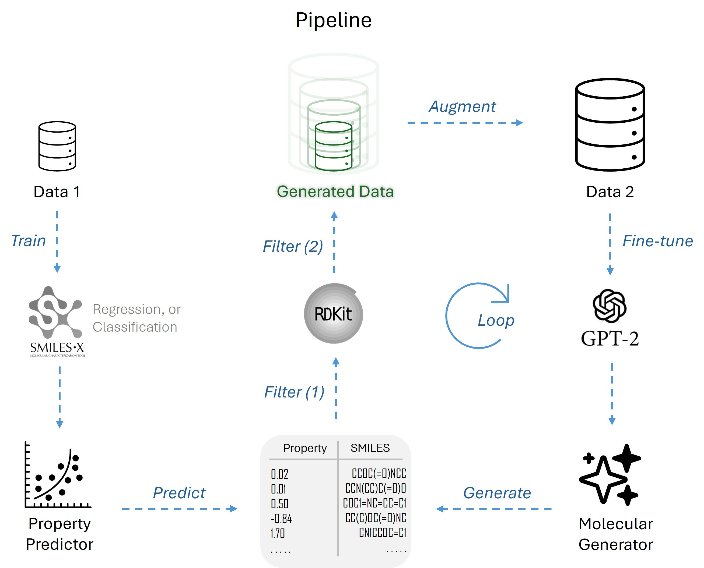

# MolDisc 1.0 will be available soon . . .


MolDisc is an autonomus molecualr discovery tool based on SMILES (Simplified Molecular Input Line Entry System). 

## MolDisc Pipeline

MolDisc is developed using following existing tools,
- SMILESX (https://github.com/Lambard-ML-Team/SMILES-X)
- GPT2 (https://huggingface.co/openai-community/gpt2)
- RDKit (https://www.rdkit.org/)

The overall pipline of MolDisc is shown the following figure.



Input data to the MolDisc has to be provided as a label.csv and unlabeled.csv files containing SMILES with labels and only SMILES respectively. At the first state of pipeline SMILESX is trained with labeled data. In the second stage of the pipeline both labeled and unlabeled SMILES are used to finetune the pretrained GPT model. From the trained GPT model new SMILES are generated which are passed through RDKit to sanitize to retain valid molecules. The trained SMILESX model is used to predict the properties of SMILES to select an appropriate set to aggregate to the unlabled dataset. The pipeline continues SMILES generations until the satisfaction of termination conditions. For more details of the pipeline please refer to the paper (paper.pdf).     


## Installation

MolDisc requires a [conda environment](https://www.anaconda.com/). 
We recommend miniconda for non-commercial usage. Installation guide for miniconda is available here https://www.anaconda.com/docs/getting-started/miniconda/install.

Moldisc requires both TensorFlow and Pytorch. Due to possible version conflicts of TensorFlow and Pytorch MolDisc requires two separate conda environments for SMILES-X and GPT. <!--In order to create and install the conda environments  run the requirements_main.txt and requirements_gpt.txt as follows -->

#### Setting up environment for SMILES-X

Execute the following command to create the environment main_smilesx for SMILES-X installation with TensorFlow.

```
conda create --name main_smilesx python=3.10
```
The following command activates the main_smilesx environment and install the required software for SMILES-X.

```
conda activate main_smilesx
pip install -r requirements_main.txt
```

#### Setting up environment for GPT2

Next, Execute the following command to create the environment for GPT2

```
conda create env subGPT python=3.10
```

The following command activates the -- environment and install the required software for GPT2.

```
conda activate subGPT
pip install -r requirements_gpt.txt
```


## 


## Tutorial

A step-by-step guide for molecular generation is available in this [Jupyter tutorial](./example.ipynb).

## Reference

Use the following reference to cite MolDisc

```
-- ,-- ,-- , 
```
