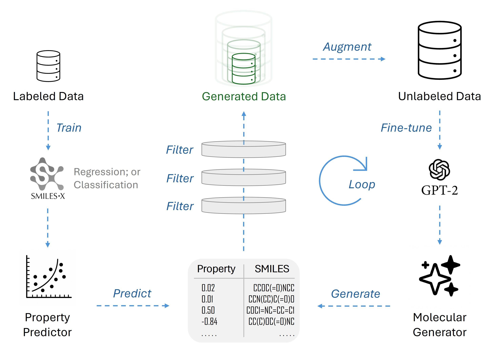

# MolDisc: A Toolkit for Iterative Molecular Discovery in Small-Data Regimes

MolDisc is an open-source toolkit for iterative molecular discovery when labelled measurements are limited. It combines a SMILES-X ensemble for property prediction with a fine-tuned GPT-2 generator, validates and deduplicates generated structures with RDKit, ranks candidates, and feeds a bounded subset back into the next generation cycle. The bundled regression and classification examples each start from 100 labelled and 1,000 unlabelled molecules.

<p align="center">
  
</p>

MolDisc supports regression and binary classification, deterministic campaign seeds, resumable runs, novelty tracking relative to the starting corpus and earlier cycles, bounded batched generation, synthetic-accessibility monitoring, several stopping rules, and machine-readable run manifests.

> MolDisc generates *screening hypotheses*. Predicted scores are not measured properties or evidence of efficacy. Check applicability domain, chemical stability, safety, synthesizability, and intellectual-property constraints before purchasing or synthesis, and validate prioritized candidates experimentally or with an appropriate higher-fidelity method.

## Workflow

1. Read `labeled.csv` (`smiles,property`) and `unlabeled.csv` (`smiles`).
2. Canonicalize SMILES, remove invalid records, and prevent labeled/unlabeled overlap.
3. Train or load a repeated cross-validated SMILES-X regression or classification ensemble.
4. Fine-tune GPT-2 on the available molecular corpus.
5. Generate in GPU batches under explicit output and attempt budgets.
6. Sanitize, canonicalize, filter, and exclude every molecule seen in an earlier cycle.
7. Predict the target and retain either the top regression fraction or classification scores above a prespecified threshold.
8. Record cycle metrics, update the feedback set, and stop under a prespecified rule.

The implementation is based on the workflows linked in [`references/README.md`](references/README.md), extended here with bounded generation, reproducible state, novelty enforcement against active inputs and prior cycles, campaign diagnostics, and automated collapse detection.

## Start here

For a first run, you do not need to write a Python program:

1. Download or clone this repository.
2. Open a terminal in the downloaded repository root and install the two conda
   environments using the commands below.
3. From that same repository root, start Jupyter Lab and open one of the
   tutorial notebooks.
4. Run the tutorial unchanged once to verify the installation.
5. Copy one of the example data folders, replace its two CSV files with your data, and change `PROJECT_NAME` in the clearly marked notebook settings cell.

The tutorial settings are intentionally small installation checks; increase model and generation budgets only after the unchanged example works.

## Installation

MolDisc intentionally uses two Python 3.10 conda environments because the TensorFlow/SMILES-X and PyTorch/Transformers stacks have different dependency constraints:

- `moldisc_main`: orchestration, SMILES-X, TensorFlow, RDKit, plotting, analysis, and Jupyter;
- `subGPT`: GPT-2 fine-tuning and generation with PyTorch, Transformers, and RDKit.

If `conda --version` is not recognized, install
[Miniconda](https://docs.conda.io/projects/miniconda/en/latest/) first and reopen
the terminal. A separate system-wide Python installation is not required.

From the repository root:

```powershell
conda env create -f environment.yml
conda env create -f environmentGPT.yml
conda activate moldisc_main
python -m ipykernel install --user --name moldisc_main --display-name "Python (MolDisc Main)"
```

These conda environments are normally installed in the current user's conda
directory and do not require administrator access. A GPU is optional for the
smoke tutorials, although GPT training and large generation campaigns are much
faster on a supported NVIDIA GPU. If an environment with either name already
exists, update or remove that environment deliberately rather than rerunning
`conda env create` over it.

For development and testing:

```powershell
conda run -n moldisc_main python -m pip install -r requirements-dev.txt
conda run -n subGPT python -m pip install -r requirementsGPT-dev.txt
conda run -n moldisc_main python -m pytest
conda run -n subGPT python -m pytest tests/test_gpt_generation.py
```

The first GPT run downloads the selected Hugging Face checkpoint to `results/.cache/huggingface`; subsequent runs reuse it. On Windows with a supported NVIDIA GPU, install the appropriate CUDA-enabled PyTorch build in `subGPT` and verify it:

```powershell
conda activate subGPT
python -c "import torch; print(torch.cuda.is_available(), torch.cuda.get_device_name(0) if torch.cuda.is_available() else 'CPU')"
```

Native Windows TensorFlow currently performs the SMILES-X stage on CPU on the tested machine; GPT-2 training and sampling use the GPU. Production runs can therefore take hours even when the tutorial completes quickly.

## Input data and provenance

Each project directory under `data/` contains:

```text
data/
└── my_project/
    ├── labeled.csv      # columns: smiles, property
    └── unlabeled.csv    # column: smiles
```

Regression targets may be any finite numeric value. Classification labels must be `0` or `1`. Canonical duplicate structures are prevented from crossing validation folds. By default, replicate regression measurements are aggregated by their arithmetic mean and contradictory classification labels raise an error; set `duplicate_policy` to `error`, `mean`, `median`, `first`, or `drop` when a different documented policy is required (`mean` and `median` are not accepted for classification).

To use your own data:

1. Copy `data/data_1` for regression or `data/data_2` for classification to a new folder such as `data/my_project`.
2. Replace `labeled.csv` and `unlabeled.csv`, retaining the exact lowercase headers `smiles,property` and `smiles`.
3. In the notebook's **User settings** cell, set `PROJECT_NAME = "my_project"`, describe the target and units, and choose a new output directory.
4. Choose at least one deterministic stopping rule and run all cells. Keep the example folders unchanged as a known installation test.

MolDisc records invalid rows, duplicates, and labelled/unlabelled overlap in `data_validation.json`; it does not modify the source CSV files.

The included examples are reproducible small-data subsets of the supplied MoleculeNet-derived collections:

- `data/data_1`: 100 aqueous-solubility labels and 1,000 unlabelled structures from ESOL, FreeSolv, and Lipophilicity;
- `data/data_2`: 100 BACE activity labels and 1,000 unlabelled structures from BACE and Tox21.

The property values of parent-dataset molecules placed in an unlabelled file are withheld and never supplied to MolDisc. The classification pool is additionally restricted to a single connected component and a disclosed allowed-element domain before sampling. See [`data/README.md`](data/README.md) for the selection protocol, source-specific citations, and dataset-licensing caveat; [`data/subset_manifest.json`](data/subset_manifest.json) for counts, audits, and exact SHA-256 digests; and [`data/provenance.json`](data/provenance.json) for the frozen-input record. The full source tables are preserved locally under `data/full_source/` but excluded from Git. The repository's MIT license applies to MolDisc software and does not relicense third-party molecular records.

## Jupyter tutorials

```powershell
conda activate moldisc_main
jupyter lab
```

Run these commands from the repository root; the notebooks locate `moldisc.py`,
`data/`, and `configs/` relative to that directory.

Open:

- [`notebooks/moldisc_reg.ipynb`](notebooks/moldisc_reg.ipynb) for regression;
- [`notebooks/moldisc_class.ipynb`](notebooks/moldisc_class.ipynb) for binary classification.

Select the **Python (MolDisc Main)** kernel. MolDisc invokes the sibling `subGPT` interpreter automatically. If it is elsewhere, pass `gpt_python_executable=r"D:\path\to\subGPT\python.exe"`.

The executed notebook cells use smoke-scale settings so a chemist can verify the end-to-end workflow locally. Each notebook also shows how to inspect a paper configuration without accidentally launching it. Smoke outputs must not be reported as scientific benchmarks.

## Reproduce the scientific campaigns

The versioned JSON files contain every campaign parameter:

- [`configs/paper_regression.json`](configs/paper_regression.json): five discovery cycles, with 1,000 valid molecules absent from the active inputs and prior cycles requested per cycle;
- [`configs/paper_classification.json`](configs/paper_classification.json): terminate at 100,000 valid molecules absent from the active inputs and prior cycles, unless a safety/collapse rule fires first.

Train and validate the predictor before generation:

```powershell
conda activate moldisc_main
python scripts/run_campaign.py --config configs/paper_regression.json --train-only
python scripts/analyze_predictor.py --config configs/paper_regression.json
```

Run a one-cycle quality-control pilot, inspect it, then resume:

```powershell
python scripts/run_campaign.py --config configs/paper_regression.json --pause-after-cycles 1
python scripts/analyze_campaign.py --config configs/paper_regression.json
python scripts/run_campaign.py --config configs/paper_regression.json --resume
```

Use the same commands with `paper_classification.json` for classification. A resume is rejected if the configuration, source files, or input files no longer match the saved campaign fingerprint. This protects the provenance of a long run.

The article also reports an optional molecular-connectivity-overlap-free withheld-parent
evaluation. It requires the original labelled parent tables under
`data/full_source/`, which are not redistributed in the public bundle; source
URLs and hashes are recorded in `data/README.md` and `data/provenance.json`.
After predictor training, run:

```powershell
python scripts/analyze_external_validation.py --config configs/paper_regression.json
```

This is a withheld parent-set analysis, not an independent external benchmark,
because parent labels were used to stratify the active 100-molecule subset.

## Python API

```python
from moldisc import moldisc

candidates = moldisc(
    project_name="data_1",
    project_folder="results/regression",
    data_name="regression_demo",
    model_type="regression",
    scale_output=True,
    k_fold_number=2,
    n_runs=1,
    n_epochs=2,
    augmentation=False,
    gpt_pretrained_model="distilgpt2",
    gpt_initial_epochs=3,
    gpt_cycle_epochs=1,
    gpt_num_generation=8,
    gpt_num_attempts=20,
    gpt_generation_batch_size=32,
    smilesx_inference_augmentation=False,
    max_generation=4,
    cycles=1,
    cutoff=0.5,
    random_seed=42,
)
```

## Stopping rules

At least one deterministic termination rule must be active. If several are set, the first one reached stops the campaign.

| Parameter | Meaning |
|---|---|
| `cycles` | Maximum completed discovery cycles; `-1` disables this rule. |
| `max_generated_molecules` | Cap on valid generated molecules absent from the active inputs and prior cycles, before property selection; `-1` disables it. |
| `max_generation` | Backward-compatible cap on property-selected molecules; `-1` disables it. |
| `target_property_value` | Stop after a cycle reaches this predicted value; direction is set by `target_property_mode="max"` or `"min"`. |
| `sa_score` | Stop if a cycle's mean synthetic-accessibility score exceeds this ceiling. |
| `collapse_min_validity` | Flag a cycle if valid decoded strings / attempts falls below this value. |
| `collapse_min_uniqueness` | Flag low uniqueness among valid decoded strings. |
| `collapse_min_novelty` | Flag low novelty relative to all previously seen molecules. |
| `collapse_min_yield` | Flag failure to fill the requested cycle output within its attempt budget. |
| `collapse_patience` | Number of consecutive flagged cycles required for automatic collapse termination. |
| `pause_after_cycles` | Operational checkpoint used for QC; it pauses without changing the scientific configuration fingerprint. |

Related controls:

| Parameter | Meaning |
|---|---|
| `gpt_num_generation` | Requested valid novel molecules per normal cycle. |
| `gpt_initial_generation` | Optional smaller first-cycle pilot request. |
| `gpt_num_attempts` | Maximum sampled strings per requested output, preventing unbounded invalid-SMILES loops. |
| `gpt_generation_batch_size` | Parallel autoregressive sequences; lower this after a GPU out-of-memory error. |
| `gpt_min_carbon_atoms` | Minimum carbon atoms required in an accepted generated structure. |
| `gpt_min_heavy_atoms` | Minimum non-hydrogen atoms required in an accepted generated structure. |
| `gpt_max_heavy_atoms` | Optional upper bound on non-hydrogen atoms; use it to keep generation inside a prespecified size domain. |
| `gpt_max_molecular_weight` | Optional molecular-weight ceiling (g mol⁻¹) applied before predictor scoring. |
| `gpt_max_logp` | Optional RDKit Crippen logP ceiling applied before predictor scoring. |
| `feedback_max_per_cycle` | Maximum selected molecules appended to the next training corpus. |
| `augmentation_max_per_molecule` | Deterministic cap on enumerated SMILES retained per training molecule; `None` keeps exhaustive enumeration. |
| `cutoff` | Regression only: fraction retained from the favorable end of the ranked cycle. |
| `classification_threshold` | Classification only: minimum positive-class probability; prespecify it from held-out validation data. |
| `smilesx_inference_augmentation` | Enables slower augmented inference; canonical inference is preferable for very large screens. |
| `smilesx_inference_max_augmentations` | Cap on enumerated representations per molecule during augmented inference. |
| `reuse_smilesx_models` | Reuse an ensemble only when its signed data, cleaned-table, hyperparameter, source-code, and artifact digests match. Unsigned or mismatched artifacts are retrained. |
| `gpt_allowed_elements` | Optional explicit element-symbol list used to reject generated molecules outside the intended chemistry domain. |
| `patience` | Stop a SMILES-X fold/run after this many epochs without validation-loss improvement; set to `0` to disable early stopping. |
| `tanimoto_max_pairs` | Bounds diversity-report sampling so it does not become quadratic. |

## Outputs

For project `results/paper/regression/data_1/`:

```text
data_1/
├── run_manifest.json                 # configuration, hashes, software, status, stop reason
├── data_validation.json              # invalid/duplicate/overlap audit
├── cycle_metrics.csv                 # generation and screening diagnostics by cycle
├── run_state.pkl                     # resumable internal state
├── SMILESX/                          # trained ensemble and model logs
├── GPT/latest_model/                 # latest generator checkpoint/tokenizer
├── tmp/candidates_cycle_*.csv        # per-cycle candidate tables
├── analysis/                         # predictor/campaign metrics and paper figures
└── final/
    ├── all_generated_candidates.csv  # every valid candidate absent from active inputs and prior cycles
    ├── generated_smiles.csv           # property-selected candidates
    ├── top_*_molecules.png
    └── tanimoto.jpg
```

`property` is the ensemble mean prediction and `prediction_std` its ensemble dispersion. Candidate tables also contain cycle, selection, and SA-score fields. An empty selected table is a valid bounded result; do not lower a threshold merely to force candidates.

## Repository status and citation

This repository contains research software associated with a manuscript **currently under review**. The source code is released under the [`MIT License`](LICENSE). Retained upstream licenses and attributions are listed in [`THIRD_PARTY_NOTICES.md`](THIRD_PARTY_NOTICES.md).

The foundational application studies are:

1. A. T. N. Fajar *et al.*, “Generating eco-friendly ionic liquids with enhanced CO2 solubility using language models,” *Artificial Intelligence Chemistry* **3** (2025) 100089. [DOI](https://doi.org/10.1016/j.aichem.2025.100089)
2. A. T. N. Fajar *et al.*, “Generative AI-Driven Accelerated Discovery of Passivation Molecules for Perovskite Solar Cells,” *Advanced Science* **13** (2026) e23042. [DOI](https://doi.org/10.1002/advs.202523042)

For scientific use, please also cite the final MolDisc article and repository release, together with MoleculeNet, SMILES-X, GPT-2/Transformers, RDKit, and the synthetic-accessibility method, as applicable.

## Contributing

See [`CONTRIBUTING.md`](CONTRIBUTING.md). Please keep scientific configuration changes versioned, add tests for behavior changes, and never commit generated checkpoints, private molecules, credentials, or unrestricted proprietary data.

<p align="center">
  
</p>
